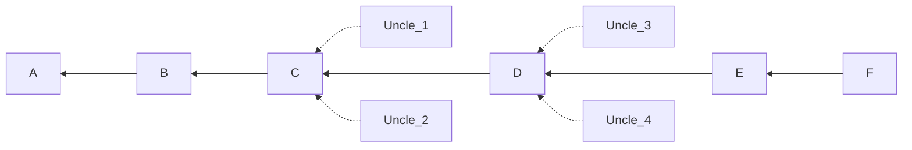
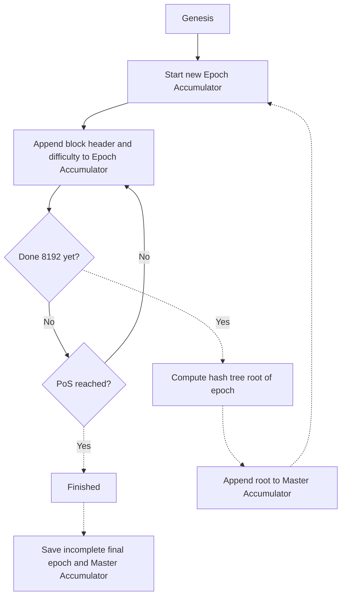

# Hash accumulator

A hash accumulator verifies that data on the Portal Network came from the canonical Ethereum chain. 
This is critical to prevent various attacks that trick clients into believing fake data came from Ethereum.

## Why are accumulators needed?

Accumulators verify that specific data genuinely belongs to the canonical Ethereum chain. 

Without this verification, an attacker could add fake Ethereum information to the Portal Network and trick clients into believing their dishonest contributions are from the true Ethereum chain.

At the same time, the accumulator helps Portal clients to tell between valid blocks that were mined but not included in the canonical chain (known as 'uncles')
and blocks that were included in the canonical chain. Uncle identification is mainly relevant to pre-merge data, from when Ethereum was still a proof-of-work network. 
However, uncles can still occur occasionally on Ethereum today when validators equivocate (publish multiple blocks for a single slot).

In the diagram below, blocks `A`-`F` are canonical, with F being the latest block. 
While `Uncle_1` may have a valid block difficulty and parent, it was not built upon.

If a Portal node is presented with an uncle block, it can check the accumulator. 
The accumulator only processes non-uncle blocks A-F, so the node will be able to tell instantly that the block it received should be rejected.

## How does the accumulator work?

### Accumulator

The "Header Accumulator" is a double-batched Merkle log accumulator.
This data structure is designed to allow nodes in the network to "forget" the deeper history of the chain, while still being able to reliably receive historical headers with a proof that the received header is indeed from the canonical chain. 
There are actually two accumulators: an epoch accumulator and a master accumulator. Each block header is appended to the epoch accumulator until the epoch ends. 
At the end of the epoch, the root hash of the collection of block headers in the epoch accumulator is computed and added to the master accumulator. 
Then, the epoch accumulator is reset to start collecting headers for the following epoch. Therefore, data is added to the epoch accumulator every time a block is produced but only added to the master accumulator once per epoch.
This is repeated for the entire Ethereum chain right up to the merge block, at which point the epoch and master accumulators can be considered complete, frozen and immutable.

For post-merge blocks, there is an equivalent accumulator ('historical_roots`) already built into the main Ethereum chain, with the hashes being available in Beacon blocks.
This means portal clients do not have to implement their own accumulator for post-merge blocks, they can simply query Beacon data.

### Proofs

Proofs are used to verify some data against the accumulator. 
A Merkle proof is generated using the hash of the block being verified as a leaf node and the root hash of the relevant epoch accumulator as the root.
The root hash of the epoch accumulator is the 'digest' and it is found in the master accumulator.
The proof asserts that a given hash is part of the accumulator. The accumulator is known to uniquely include canonical Ethereum data. 
Therefore, the proof demonstrates that a given block is canonical. Fake blocks and uncle blocks cannot produce valid proofs.
Proofs can be provided alongside any historical block data on the Portal Network, meaning that clients can instantly see whether the data is canonical or not at the moment it is received.

## Implementation

The Portal Network specification does not define precisely how Portal clients acquire a master version of the accumulator to check new data against. 
It is expected that clients will likely maintain a 'frozen' copy of the pre-merge accumulator as this data can never change or grow and can be handled as a static dataset.
The pre-merge accumulator only has to be built once, so it can be shipped with client code. Anyone can rebuild the accumulator to verify those hardcoded into clients using an Ethereum node. 

For post-merge data, clients can make RPC calls to an Ethereum node to obtain the relevant hashes. 
When the Portal Beacon Network is fully implemented, portal clients will be able to access this data without relying on access to an Ethereum node.
